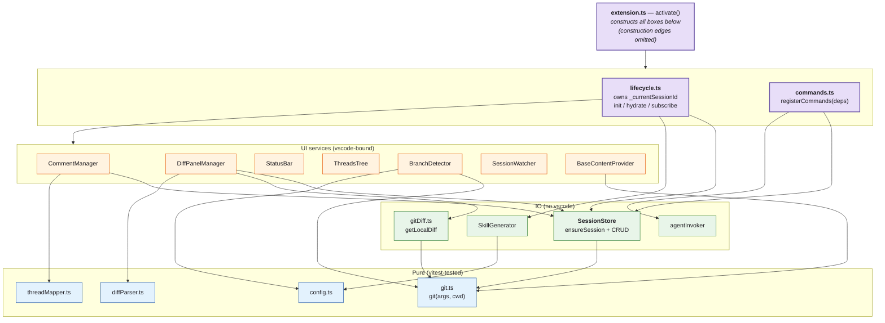

# Resolvr — Architecture

A 3.5K-LOC VS Code extension organized as three explicit layers behind a thin
activation entry. No DI container, no service locator — plain constructors and
a `deps` object.

## Layers

| Layer             | Imports `vscode`? | Imports `fs` / `child_process`? | Tested                        |
| ----------------- | ----------------- | ------------------------------- | ----------------------------- |
| **Pure**          | No                | No                              | Vitest, no mocks              |
| **IO**            | No                | Yes                             | Vitest against a tmp git repo |
| **VS Code-bound** | Yes               | varies                          | Integration / F5 only         |

Construction lives in `extension.ts`. The activation entry only does:

1. Build everything in the right order (content providers before `CommentManager` is load-bearing — virtual URIs need the provider first).
2. Hand the constructed dependencies to `createLifecycle({ … })` and `registerCommands({ … })`.
3. Call `lifecycle.subscribe()` then `lifecycle.init()`.

The lifecycle module privately owns `_currentSessionId` — the single mutable
"which session is hydrated right now" cell. It's exposed read-only via
`currentSessionId()`. The only mutators are `hydrateSession` and the
branch-change subscriber, both inside `lifecycle.ts`.

## Diagram

Only architectural edges are drawn. `extension.ts` constructs every box but
those wires are construction, not coupling, so they're omitted. Single-caller
leaf utilities (e.g. `FileDecorationProvider` → `ChangedFilesTree`) are
implementation details of their caller and not listed separately.



`SessionStore` shows up as the busiest node, which is correct: it's the
model. Five readers around one writable store is the right shape for a
file-backed extension, and the reason the IO layer pays off as a seam.

## Key flows

**Session creation** — one path for both UX entry points:

```
Start Review command  ─┐
                       ├─→ SessionStore.ensureSession({ defaults })
First comment (auto)  ─┘            │
                                    └─→ atomic write → onDidCreateSession
                                                              │
                                                              └─→ lifecycle.hydrateSession
```

**Diff base resolution** — the file list and base-content provider share one
result so they cannot diverge:

```
DiffPanelManager.populate
  ├─→ resolveDiffBaseRef(target, mode)   → SHA (merge-base) or ref (target-tip)
  ├─→ BaseContentProvider.setBaseRef(sha)
  └─→ getLocalDiff(target, sha)          → unified diff + numstat
                                              │
                                              └─→ parseDiffFileList + applyLineStats
```

**Live updates** — `SessionWatcher` is the single inbound channel for external
edits to the session file. Self-writes are suppressed via the
`onBeforeWrite` callback wired at construction in `extension.ts`.

## Conscious non-choices

These are alternatives we explicitly **don't** use, and why:

- **No DI container** (inversify, tsyringe). GitLens and `vscode-pull-request-github` use plain constructor passing; at this size, indirection costs more than it saves.
- **No `vscode` abstraction layer.** Wrapping `vscode.window.showQuickPick` etc. is pure cost without any portability story.
- **No class-per-command pattern.** All commands are functions registered in one `registerCommands(deps)` aggregator — matches modern extensions.
- **No feature-folder layout** (`src/diff/`, `src/threads/`). Worth doing once the codebase passes ~5K LOC; today the flat `src/` plus the `activation/` carve-out is honest.
- **No service emitter for the `onBeforeWrite` echo-suppression.** A one-shot callback is simpler than a fan-out event.

## Validation

- **Type-check:** `make type-check` (clean)
- **Tests:** `make test` — 18 vitest cases pinning the pure layer (`diffParser`, `gitDiff` helpers)
- **Dead-code:** `make knip` (clean)
- **Runtime:** smoke-test via **F5** — create a comment, switch branches, open the diff panel. Type-check and unit tests do not cover wiring regressions.
